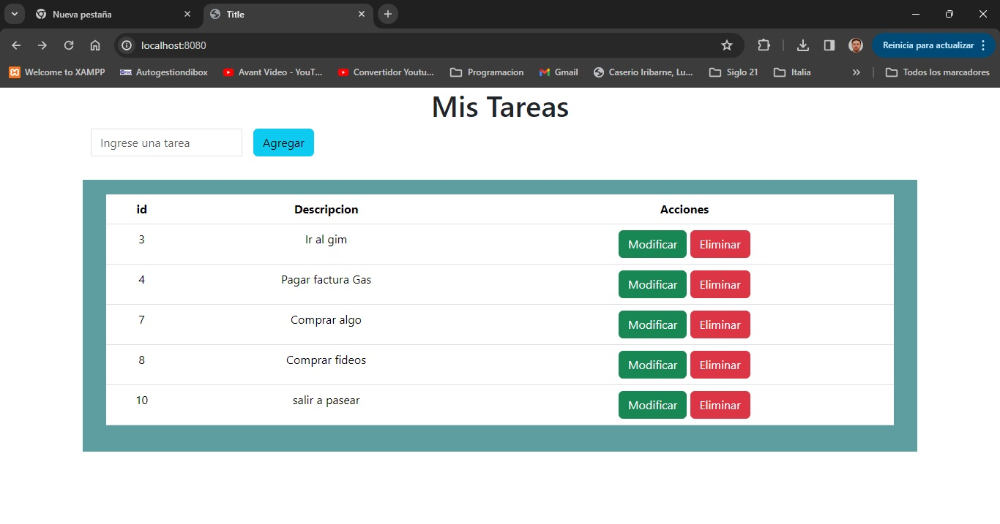
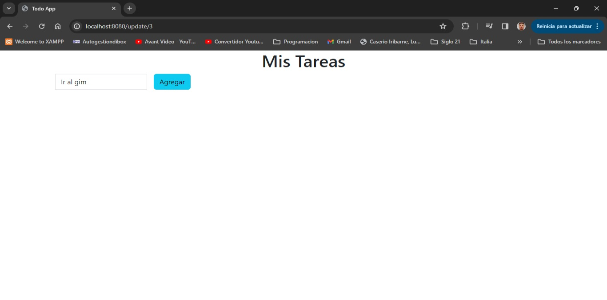
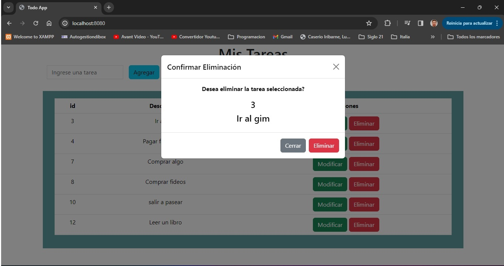

### TODO APP

Desarrollo de una App Web simple utilizando el Framework SpringBoot
La app consiste en un Todo List el cual nos permite ingresar tareas, listar, modificar y eliminar. 

Este proyecto esta basado en la plantilla [Admin Lte3]
(https://github.com/ColorlibHQ/AdminLTE)

## Instalación

### 1 Paso
<<<<<<< HEAD

**1 forma.** Dar clic en Code y luego en Download Zip
=======
**1 forma**. Dar clic en Code y luego en Donwload Zip

>>>>>>> bfebc8457acf53b2e33cd56ad9660e4843055698
**2 forma.** Crear una carpeta, ingresar a git bash y ejecutar

git clone https://github.com/PatEche/SofttekActividad5.git

### 2 Paso
- Crear una base de datos con el nombre **bd_todo**
- Luego restaurar la base de datos **"bd_todo_todo_item"**

### 3 Paso
- Abrir un IDE e importar el proyecto que descargamos
- Correr el proyecto desde el IDE

### 4 Paso
-Abrir un navegador y escribir la siguiente URL **http://localhost:8080/**

## Vista previa
-Pantalla Principal

## Listar y Agregar

## Modificar Tarea

## Eliminar Tarea
<<<<<<< HEAD

=======

>>>>>>> bfebc8457acf53b2e33cd56ad9660e4843055698
